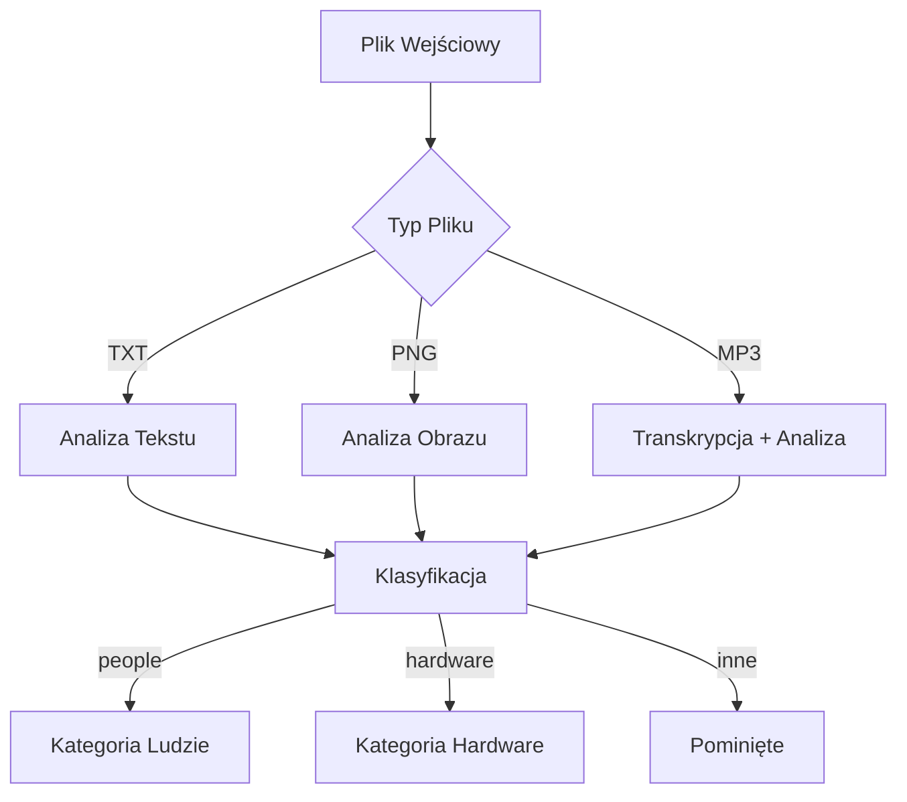

# 🏭 Fabryka Robotów: Analiza Raportów Patrolowych

## 🎯 Zadanie
Zdobyliśmy dostęp do danych z fabryki, którą nam wskazałeś. Są to raporty dzienne kilku działających tam oddziałów. Część z nich to zwykłe raporty techniczne, a część to raporty związane z bezpieczeństwem. Pozyskane dane są w różnych formatach i nie wszystkie zawierają użyteczne dane. Wydobądź dla nas proszę tylko notatki zawierające informacje o schwytanych ludziach lub o śladach ich obecności oraz o naprawionych usterkach hardwarowych (pomiń te związane z softem oraz pomiń katalog z faktami). Raport wyślij do zadania “kategorie” w formie jak poniżej. Pliki powinny być posortowane alfabetycznie.

Oto dane źródłowe: https://c3ntrala.ag3nts.org/dane/pliki_z_fabryki.zip
{
  "people": ["plik1.txt", "plik2.mp3", "plikN.png"],
  "hardware": ["plik4.txt", "plik5.png", "plik6.mp3"]
}


Co trzeba zrobić w zadaniu?

Twoim zadaniem jest przeanalizowanie danych z fabryki (raporty dzienne w różnych formatach) i wyodrębnienie notatek zawierających informacje o schwytanych ludziach lub śladach ich obecności oraz o naprawionych usterkach hardwarowych. Pomiń raporty dotyczące oprogramowania oraz folder "facts". Wyniki prześlij w formacie JSON do centrali.

Kroki do wykonania:\
- Pobierz i rozpakuj dane: Pobierz archiwum ZIP z linku: https://c3ntrala.ag3nts.org/dane/pliki_z_fabryki.zip i rozpakuj je.
- Przejrzyj pliki: W archiwum znajdziesz pliki TXT, PNG i MP3. Pomiń folder "facts" oraz plik bez rozszerzenia (jest związany z inną flagą). Plik `weapons_tests.zip` również pomiń na tym etapie.

Analiza zawartości:
- TXT: Odczytaj zawartość plików tekstowych.
- PNG: Wykorzystaj model multimodalny (np. `gpt-4o`, `gemini-2.0-flash-exp`, `claude sonet`) lub bibliotekę OCR do ekstrakcji tekstu z obrazów.
- MP3: Użyj modelu transkrypcji mowy (np. `whisper`) do konwersji dźwięku na tekst.

Kategoryzacja: Na podstawie wyekstrahowanego tekstu (lub oryginalnej zawartości plików TXT) zdecyduj, czy dany plik zawiera informacje o:
- Ludziach: Uwzględniaj tylko notatki zawierające informacje o schwytanych ludziach lub o śladach ich obecności.
- Hardware: Usterki hardwarowe (nie software).
Jeśli plik nie pasuje do żadnej z powyższych kategorii, pomiń go. Nie twórz żadnych dodatkowych kategorii. 

Format odpowiedzi: Przygotuj dane w formacie JSON, sortując alfabetycznie nazwy plików w każdej kategorii. Zastąp `YOUR_API_KEY` swoim kluczem API.
{
      "task": "kategorie",
      "apikey": "YOUR_API_KEY",
      "answer": {
        "people": ["plik1.txt", "plik2.mp3", "plikN.png"],
        "hardware": ["plik4.txt", "plik5.png", "plik6.mp3"]
      }
}

Wysyłka: Wyślij dane JSON metodą POST na adres: `https://c3ntrala.ag3nts.org/report`. Upewnij się, że wysyłasz dane zakodowane w UTF-8.

Wskazówki:
- Uważaj na nazwy plików: Upewnij się, że nazwy plików w JSON-ie są identyczne z nazwami w archiwum ZIP (wielkość liter ma znaczenie!). Ścieżki do plików nie są akceptowane, tylko same nazwy.
- Koszty: Analiza obrazów może być kosztowna. Używaj modeli multimodalnych (np. `gpt-4o`, `gpt-4.1-mini`) lub bibliotek OCR, aby wyciągnąć tekst z obrazów. Zapisz wyniki ekstrakcji do plików, aby uniknąć ponownego przetwarzania tych samych danych.
- Limity OpenAI: Jeśli masz niski tier w OpenAI, możesz napotkać ograniczenia liczby zapytań na minutę (TPM). Rozważ spowolnienie wykonywania kodu lub użycie alternatywnych modeli/API (np. `openrouter.ai`).
- Promptowanie: Eksperymentuj z różnymi promptami, aby uzyskać jak najlepsze wyniki kategoryzacji. Rozważ dodanie przykładów do promptu. Pozwól modelowi "pomyśleć" (np. poprzez prośbę o uzasadnienie decyzji) przed podaniem ostatecznej odpowiedzi.
- Debugowanie: Jeśli z API Centrali otrzymujesz błąd 400, sprawdź treść odpowiedzi (body), aby uzyskać wskazówki dotyczące problemu.

Dokumentacja Swagger:
https://c3ntrala.ag3nts.org/swagger/?spec=S02E04-ijvuioyjkdf.json 

## 🧠 Kluczowe Koncepcje

### 1. Architektura Rozwiązania
Rozwiązanie działa jak inteligentny system klasyfikacji dokumentów, wykorzystujący:
- GPT-4 Vision do analizy obrazów
- Whisper do transkrypcji plików audio
- GPT-4 do klasyfikacji tekstu
- System cachowania transkrypcji (aby nie transkrybować tych samych plików MP3 wielokrotnie)

### 2. Proces Przetwarzania


### 3. Inteligentne Promptowanie
System używa precyzyjnie skonstruowanego promptu, który:
- Definiuje dokładnie, co należy klasyfikować jako "people" (tylko raporty robotów o schwytanych ludziach)
- Rozróżnia usterki hardware od software
- Wymaga jednoznacznej odpowiedzi (people/hardware/none)

### 4. Optymalizacje
- Cachowanie transkrypcji MP3 w folderze `transcriptions/`
- Sortowanie plików alfabetycznie
- Obsługa błędów dla każdego pliku osobno
- Pomijanie folderu "facts" i plików bez rozszerzenia

## 💡 Ciekawe Aspekty Implementacji

### 1. Obsługa Różnych Formatów
```python
# Dla plików TXT - proste odczytanie
with open(path, "r", encoding="utf-8") as f:
    content = f.read()

# Dla obrazów - konwersja do base64
img_b64 = base64.b64encode(img_file.read()).decode("utf-8")

# Dla MP3 - transkrypcja przez Whisper API
response = requests.post(
    "https://api.openai.com/v1/audio/transcriptions",
    headers={"Authorization": f"Bearer {OPENAI_API_KEY}"},
    files={"file": (os.path.basename(mp3_path), audio_file, "audio/mpeg")},
    data={"model": "whisper-1", "language": "en"}
)
```

### 2. System Klasyfikacji
- Używa GPT-4 z temperature=0 dla spójnych wyników
- Każdy plik jest analizowany niezależnie
- Wyniki są agregowane do dwóch kategorii: "people" i "hardware"

### 3. Bezpieczeństwo i Konfiguracja
- Klucze API przechowywane w zmiennych środowiskowych (.env)
- Obsługa błędów na każdym etapie przetwarzania
- Walidacja odpowiedzi API

## 🎓 Wnioski i Lekcje

1. **Modularność**: Rozwiązanie pokazuje, jak efektywnie łączyć różne modele AI (GPT-4, Whisper) w jeden spójny system.

2. **Optymalizacja Kosztów**: 
   - Cachowanie transkrypcji MP3
   - Precyzyjne prompty zmniejszające liczbę tokenów
   - Efektywne przetwarzanie obrazów

3. **Robustność**:
   - Obsługa różnych formatów plików
   - System cachowania
   - Obsługa błędów na każdym etapie

4. **Best Practices**:
   - Czytelna struktura kodu
   - Dokumentacja w kodzie
   - Logowanie procesu klasyfikacji
   - Bezpieczne zarządzanie kluczami API

## 🚀 Jak Działa w Praktyce

1. Program skanuje folder `source/` w poszukiwaniu plików
2. Dla każdego pliku:
   - Określa typ (TXT/PNG/MP3)
   - Przetwarza zawartość odpowiednią metodą
   - Klasyfikuje do kategorii
   - Zapisuje wynik
3. Agreguje wyniki w formacie JSON
4. Wysyła raport do API centrali

## 📊 Przykładowy Wynik
```json
{
  "task": "kategorie",
  "apikey": "***",
  "answer": {
    "people": ["report1.txt", "patrol2.mp3", "evidence3.png"],
    "hardware": ["repair4.txt", "malfunction5.png"]
  }
}
```

To rozwiązanie pokazuje, jak efektywnie wykorzystać nowoczesne modele AI do rozwiązania złożonego problemu klasyfikacji dokumentów w różnych formatach, z zachowaniem wysokiej jakości i efektywności kosztowej. 